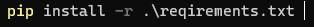
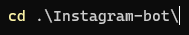

# Instagram-bot
An instagram bot which follows or unfollows a list of people (valid usernames) you give it.  
!FIRST PROJECT WITH SELENIUM MIGHT HAVE BUGS!

# HOW TO USE #

!FOLLOW AND UNFOLLOW ARE THE ONLY COMMANDS THAT WORK!  
!ENTER ONLY VALID USERNAMES!  
!ENTER USERNAME AND PASSWORD IN SECRETS.PY!

-Requirements installation  

-Selenium installation  
  

-Running the script  
  
  

# Installing PIP #

WINDOWS  
  

UBUNTU/DEBIAN  

